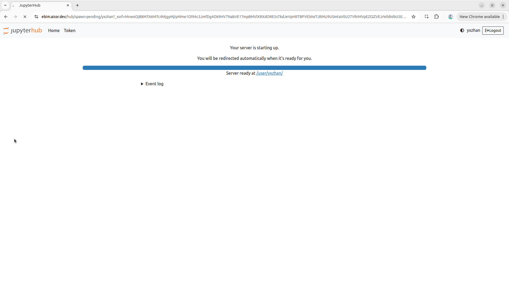
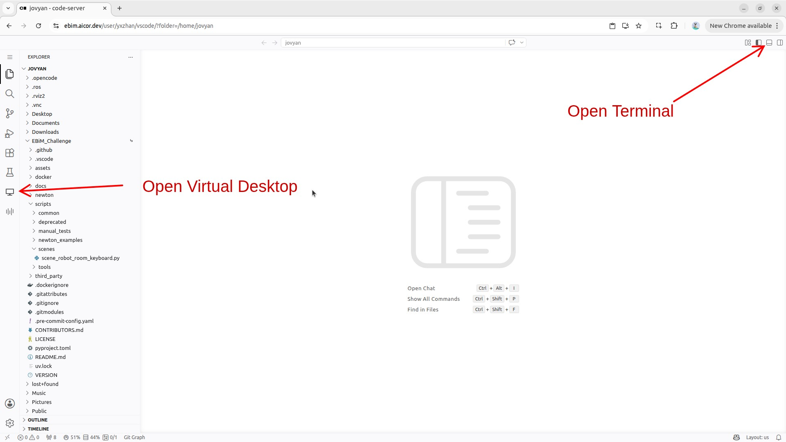
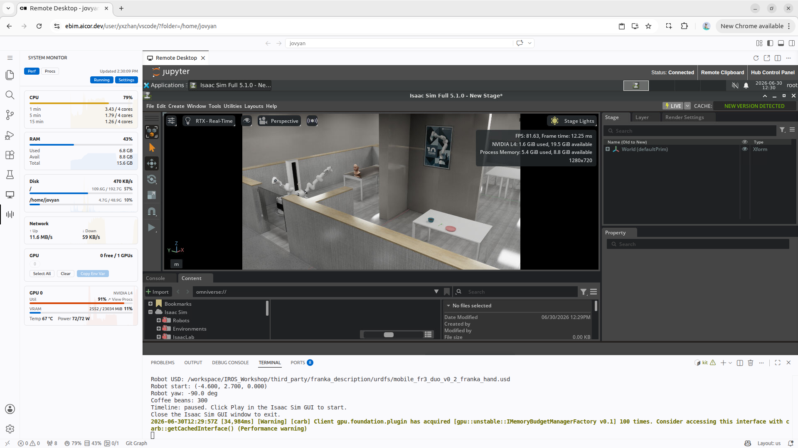

# EBiM Challenge on Google Cloud — User Guide

This guide helps you access and run the Isaac Sim simulation environment for the EBiM Challenge, hosted as a JupyterHub service on Google Cloud.

---

## Prerequisites

- A **GitHub account** (used for login)
- A modern browser such as **Chrome / Edge** is recommended
- A stable network connection (the simulation view is streamed live to your browser and is bandwidth-sensitive)

---

## Steps

### 1. Open the service

Navigate to:

👉 **https://ebim.aicor.dev/**

### 2. Sign in with GitHub

On the login page, click **Sign in with GitHub** and authorize with your GitHub account.

> 💡 On first login, GitHub will ask you to authorize the application — click **Authorize** to continue.

### 3. Start your server

After signing in, click **Start My Server**.

> ⏳ **Please be patient.** The first launch pulls the container image and initializes the environment, so **it can take several minutes**. This is normal — do not refresh or close the page while it starts.



### 4. Open the Virtual Desktop and a terminal and launch the scene

Once the server is ready, you will be taken to the **VS Code** interface.

- In the left activity bar, click the **Virtual Desktop** button to open the graphical desktop view.

- Click the **Toggle Panel** button in the top-right corner to open the **Terminal**.

  

- In the terminal, run the following command:

  ```bash
  python EBiM_Challenge/scripts/scenes/scene_robot_room_keyboard.py
  ```

### 5. Wait for the simulation, then run it

- Wait for the **Isaac Sim environment to fully start** (loading the scene for the first time also takes a little while).
- Once the simulation is ready, click the **Play** button to start the simulation.

  

### 6. Restart the server (when needed)

If you need a clean environment, restart the server:

- Go back to **https://ebim.aicor.dev/**
- Click **Stop My Server**, then click **Start My Server** again.

> ⚠️ **Only files under your home directory (`/home/jovyan`) are preserved across restarts.** Everything outside of it is reset to the original image. For example, software you installed with `apt` will be gone after a restart and must be reinstalled. Keep any work you want to retain inside `/home/jovyan`.

---

## Performance Test Report

The simulation was tested on the following Google Cloud compute configuration:

| Resource | Specification          |
| -------- | ---------------------- |
| Machine  | G2-standard-4          |
| CPU      | 4 vCPU                 |
| Memory   | 16 GB RAM              |
| GPU      | NVIDIA L4              |

The screen recording below shows the simulation running in real time on this configuration:

https://github.com/user-attachments/assets/REPLACE_WITH_UPLOADED_VIDEO
